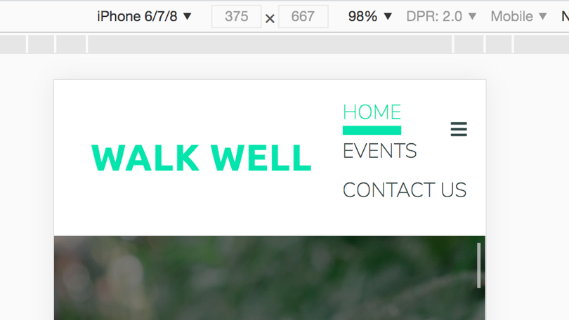
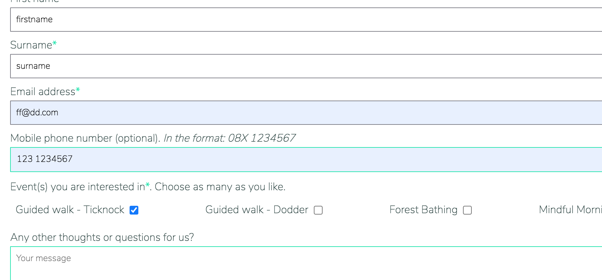
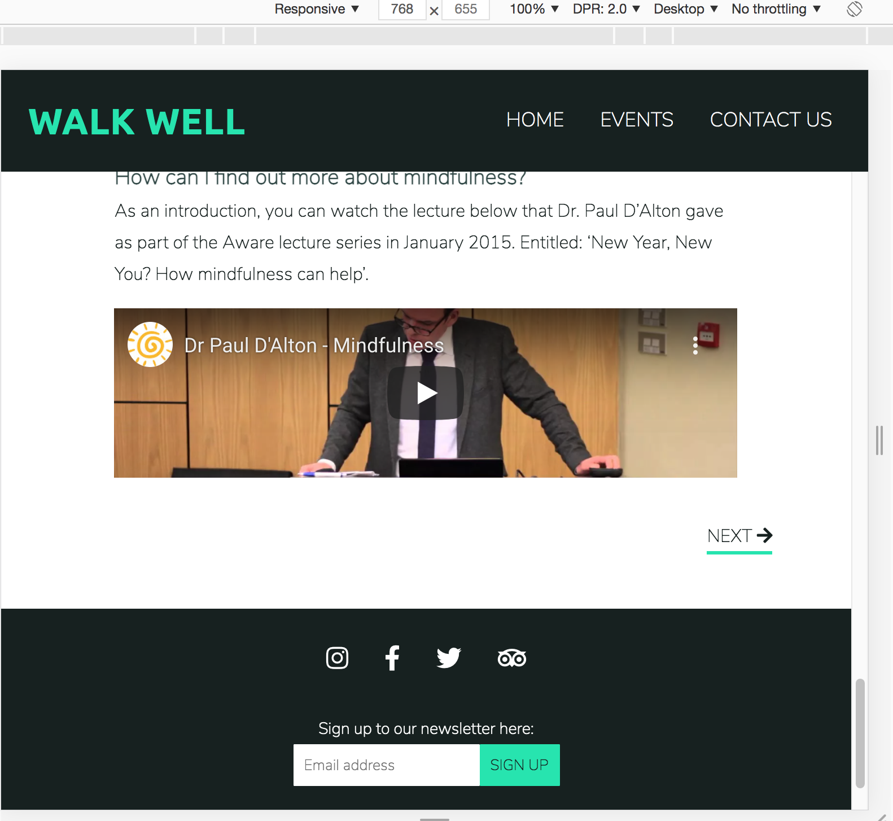
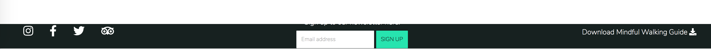
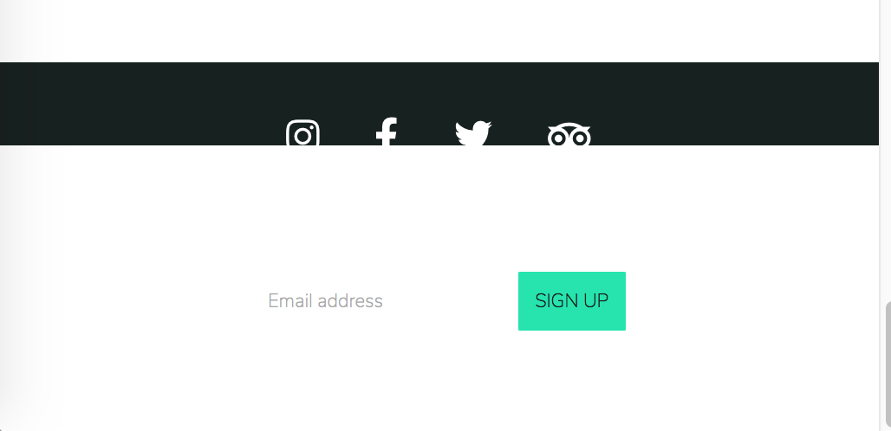
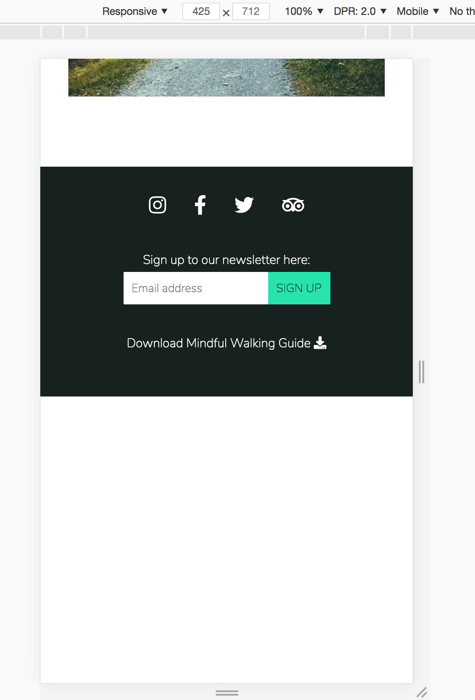

# Walk Well
---

[View the live website here.](https://fiona-t.github.io/walk-well/)

This website was created for educational purposes as a student of Code Institute, and the business described below is a fictional one.

*Screenprint of website on devices to be added.*

## Purpose
---
Walk Well is a website dedicated to the practice of mindful walking and has two distinct purposes:
1) provides users with simple, easily accessible information on how they can incorporate meditation into their daily movement with the practice of mindful walking. 
2) provides information about the events we run, which are small guided group walking sessions for participants to experience a longer and structured mindfulness session and connect with like-minded individuals.

Mindful walking is a very simple technique that almost anyone could incorporate into their day. It is free, quick, simple, requires no special equipment and can be incorporated into existing daily schedules. It makes meditation and mindfulness more accessible by 1) combining it with the act of walking/moving about which is something a lot of us do daily and are familiar with and 2) easily integrating mindfulness into existing routines without having to dedicate extra time to it. 

Many added walking into their daily routine due to the pandemic restrictions because they couldn't access gyms or other forms of exercise. The information and tools on the website aim to encourage people to not only keep up a daily walking habit but also show them that mindfulness is a versatile tool that can be added to any walk, even part of a commute, to reap additional benefits.

The events and group walks add a community feel and help people further their knowledge on the area of walking, mindfulness and meditation.

The target audience therefore is quite wide, but broadly speaking is people with an interest in health, mental wellbeing, mindfulness, meditation, yoga; as well as people who are curious about meditation and mindfulness but maybe have never tried it. The target audience is located in Ireland since the events and group walks are based in and around Dublin.

####    User’s goals:
-	the site's users are interested in mindfulness and want to find out more
-   they want to access information to practice mindful walking straight away
-	they may also want to learn more about mindfulness, walking and meditation generally
-   they may want to connect with the wider community around mindfulness, walking and meditation

####    Site owner’s goal:
-	the goal of the site is to empower people to bring mindfulness to their daily lives in an easy and accessible way by providing the information to do this via mindful walking; and providing more detailed information to those users interested in reading up further
-   the second goal of the site is to foster a sense of community around mindful walking by attracting people together through guided walks and events based around mindfulness, walking and meditation; and sharing a community newsletter

## User Experience (UX)
---
- ### User stories
Note: the website is static and as such does not have a login for registered users. Therefore all user stories are in the context of a visiting user.

- #### Home page
    1. As a visiting user, I want to find out what mindful walking is and its benefits, so that I can decide if it is something I want to do
    2. As a visiting user, I want to find the mindful walking guide, so that I can start my mindful walking practice.
    3. As a visiting user, I want to check for any new articles on walking/mindfulness/meditation, so that I am informed on this area.

-   #### Events/Walks page
    1. As a visiting user, I want to view the upcoming events and their dates, so that I can plan if I want to attend any events.
    2. As a visiting user, I want to register my interest for an upcoming event, so that I can be contacted with more information by the website owner.
    3. As a visiting user, I want to read the user reviews of previous events, so that I can make a decision on which event, if any, to attend.

- #### Contact Us page
    1. As a visiting user, I want to register my interest for an upcoming event, so that I can be contacted with more information by the website owner.

- #### Footer (on all pages)
    1. As a visiting user, I want to sign up for the newsletter so that I am emailed a round up on new articles that were added to the website, and information on upcoming events.

- ### Design
The look and feel of the website is modern, minimal clean design, in keeping with the purpose of the website which is to promote mindfulness and also references the outdoors and nature.
- #### Colour Scheme
    - the main colour used is #00AAA0 a shade of green, to reflect the theme of nature
    - a dark grey #334B49 is used for the text
    - and a dark orange #F26945 is the accent color

These colours help promote the feeling of calmness, connection with nature, while still being fresh. And the accent provides a pop of colour.

- #### Typography
    - Nunito Sans - Light is used for the main body copy throughout the website. This is a clean, readable, sans serif font. The fallback option is 'sans serif'
    - Ubuntu - Bold is used for the headings to add a touch of personality and warmth.

- ### Wireframes
    - Desktop wireframes:
        - [Home page, landing section](docs/wireframes/home-page-landing.png)
        - [Home page, Introductory section](docs/wireframes/home-page-intro.png)
        - [Home page, Get Started section](docs/wireframes/home-page-walk.png)
        - [Home page, More Reading section](docs/wireframes/home-page-more-info.png)
        - [Events page, Upcoming Events section (top of page)](docs/wireframes/events-page-section-one.png)
        - [Events page, User Reviews and Gallery (scrolled down on page)](docs/wireframes/events-page-scroll.png)
        - [Contact page](docs/wireframes/contact-page.png)

    - Mobile wireframes:
        - [Home page, landing section](docs/wireframes/mobile-home-page-landing.png)
        - [Home page, Introductory section](docs/wireframes/mobile-home-page-intro.png)
        - [Home page, Get Started section](docs/wireframes/mobile-home-page-walk.png)
        - [Home page, More Reading section](docs/wireframes/mobile-home-page-more.png)
        - [Events page](docs/wireframes/mobile-event-page.png)
        - [Contact page](docs/wireframes/mobile-contact-page.png)

    - Changes to wireframe design as project progressed:

        As the wireframes are basic outline sketches for each page, some changes were made to the design over the course of the project, where relevant.
        - Home page: the three boxes to allow user jump to each section of the home page were originally overlaid on the hero image. However in mobile view these obscured the hero image rendering it ineffecive. A new section below the hero image was created to contain these three boxes, and a call to action button 'Let's Go!' added to the hero image to invite the user to access the site content. This gives more breathing room to the hero image landing section on mobile; and a more impactful hero image on desktop.
        - Home page - Get Started section: the wireframe shows an image accompanying each paragraph, however the finished site instead incorporates an icon beside each heading. This section is relatively long and the images would have added to this length without providing much in the way of additional benefit to the user experience, especially on mobile because there would have been an image below each paragraph. The icons add a pop of colour and break up the text so are a better solution. Without the images, it means this text can display over two columns on large screen; and as one continuous column of text on mobile. The information in this section is key for the site goal, so the images in this case would have detracted from that goal.
        - Events page: An introductory section was added which was not shown on the wireframe. This was added because the section needed some text to give the user context as to what the page was about; and to add some personality/add a welcoming tone to the page.
        - Events page - Upcoming Events table: On the mobile wireframe the table is depicted as being a smaller version of the larger screen table. In reality, the table could not been shown in full on mobile and would have introduced horizontal scrolling. Therefore on mobile and tablet view, the table is collapsed into 'mini tables' with each event displayed in it's own single column table. This is much easier to read than a full size horizontal scrolling table on a smaller screen.
        - Footer: The 'Guide to Mindful Walking' pdf download was added to the footer during development, it is not shown on the wireframes. This was added because it improves the user experience by having this guide easily accessible from any page (not just the Get Started section).
        - Footer - position: the wireframes show a fixed footer on all screens. However upon researching further, this was bad UX design because, especially on mobile, it would take up too much screen space since the site also has a fixed header. 
        - Footer - layout: the footer on mobile view is shown on the wireframes with everything on one row. On the finished site the footer is stacked into three rows: social media, newsletter sign up, pdf download. This allows more space around the elements and since the footer is not fixed, this does not take 
        - Logo: the wireframes show a logo for the site, however this is not included in the final site as the wordmark sufficed for the purposes of the project. 

## Features
---
### Existing Features
- #### Navigation Bar
    - Navigation bar at the top of each page, fixed. Name of site and logo on left; menu items on the right. Three menu options: Home, Events, Contact Us. Different styling for the active page, and for hover and focus.
    - When viewed on a mobile phone, the logo and site name remains on the left but the menu items are collapsed into a hamburger menu which expands when clicked, to show the three menu items below the nav bar.

- #### Footer
    - Fixed *tbc if it should be fixed, maybe not fixed on mobile view, for space?* at the bottom of each page and contains social media links on the left (facebook, twitter, instagram and tripadvisor); and sign up to the newsletter on the right
    - Newsletter sign up consists of one field for email address with corresponding label and Sign Up button. Email address field has placeholder text and validation to ensure an email address is entered. Leads to confirmation page after submitting.
    - Layout may change to two rows on mobile view
- #### Home page
    - Nav bar and footer as above. 
    - Hero image at top of the page, with three boxes overlaid. What; Walk and Why. Each box is a link to the below three sections on the page.
    - What: introductory section - basic information with accompanying video.
    - Walk: steps for the user to follow, along with the option to download the steps?
    - Why: further information in the form of articles. These are shown as summary boxes in a rows of three across, with a link to click to read the full article. 
    - on mobile view the columns collapse into one vertically aligned column.

-   #### Events/Walks page
    - Nav bar and footer as above. 
    - Table showing upcoming events and walks, including event name, date, duration, short explanation
    - User reviews shown in summary boxes. User name, comment and star rating. 
    - Image gallery from previous events.
    
- #### Contact Us page
    - Nav bar and footer as above. 
    - Contact form consists of the following fields and validations:
        - First Name: text, mandatory
        - Surname: text, mandatory
        - Email address: must be valid format for email address, mandatory
        - Mobile phone number: restricted to begin with one of the mobile phone operator prefixes, i.e. 087, 086, etc. Optional
        - Event/walk of interest: list of valid options, user can select more than one
        - Message: text, optional 
    - Button to submit
    - Success page is displayed after submitting.

### Future Features
- option for users to book onto walks/events directly and make payment on the website
- option to register as a user of the website
- personalised content for registered users:
    - see upcoming events that they are registered for
    - post reviews for events that they attended
    - upload images for events that they attended
- integrate trip advisor event reviews into the website?
- a new page for Community where registered users can:
    - map out a new walk
    - invite others/plan a meetup to do the walk together (this is distinct from the guided mindfulness walks as it just a group meeting rather than being guided)

## Technology
---
### Languages 
-   HTML
-   CSS
-   Note: JavaScript was used for one aspect of the project, namely the opening of the hamburger icon. The code for this function is credited in the Credits section below.

### Frameworks, Libraries, Programmes and Tools
-   [Balsamiq](https://balsamiq.com/) to create the wireframes
-   The fonts used in the project are imported from [Google Fonts](https://fonts.google.com/) 
-   [Font Awesome](https://fontawesome.com/) for the icons used throughout the site 
-   Git for version control, using the [Gitpod](https://www.gitpod.io/) terminal to commit to Git and push to GitHub
-   [GitHub](https://github.com/) to store the project code and host the live project
-   [Photoshop](https://www.adobe.com/ie/products/photoshop.html) to crop and re-size some of the images so they were correct aspect ratio
-   [Tiny jpg](https://tinyjpg.com/) to compress the images so that pages load quicker
-   [Webaim Contrast Checker](https://webaim.org/resources/contrastchecker/) to check the contrast for the colour choices on the website
-   [Chrome Dev Tools](https://developer.chrome.com/docs/devtools/) was used during development and testing to fix issues with the code and check for responsiveness/different device sizes
-   [W3C HTML validator](https://validator.w3.org/) to validate the HTML code
-   [W3C CSS Validator](https://jigsaw.w3.org/css-validator/) to validate the CSS code
-   [Am I Responsive](http://ami.responsivedesign.is/) to generate the mockup image showing the project on different devices
-   [Eye Dropper](https://eyedropper.org/) extension for Chrome was used to pick and generate colours for the project
-   [Color Space](https://mycolor.space/) to generate colour palettes when deciding on the colour scheme for the project

## Testing
---
### Code Validation
The [W3C Markup Validation Service](https://validator.w3.org/) was used to validate the HTML on every page of the project. On the first validation some issues were flagged and these were resolved as explained below:

-   **Text not allowed in element `<iframe>` in this context.** I had included `
` inside the `<iframe>` with a note for users of older browsers if the content failed to load, and a link to where the content could be viewed on YouTube. However the W3C recommendation on this have changed and I removed the text from inside the `<iframe>`. 
-   **Bad value 100% for attribute width on element `<video>`: Expected a digit but saw % instead** I had originally used `width="100%"` so that the `<video>` would resize responsively. I amended this to set a width and height in the html and added `max-width: 100%` and `height:auto` in the CSS instead.
-   **Bad value `#` for attribute `method` on element `<form>`** I had done this because the the data from the forms in this project do not get sent anywhere. I removed the `method` attribute from the `<form>` elements to correct this error. 
-   **Warning: Possible misuse of `aria-label`** The `aria-label` was on the `` element containing the elements with the font-awesome `<i>` star icons for the star rating in the Events page. To fix this error, I added `role="img"` to the `` so that the screenreader knows to read out the `aria-label` on this element. 

The [W3C CSS Validation Service](https://jigsaw.w3.org/css-validator/) was used to validate the CSS file used for the project. There were no errors found.

### Test Cases
This section covers testing the user stories from the User Experience (UX) section.

### Fixed Bugs
These bugs were encountered during development and during testing.

-   **Issue: Mobile menu not opening below logo:**

>Solution: Amended the flex container (the `ul`) to `flex-direction: row;` (from column), with `wrap`, to make them wrap on to the next line.
And on the child (`li`) adding `min-width: 100%;`

-   **Issue: Contact form, pattern not validating first three digits of mobile phone number:**

>Solution: The pattern was incorrect as it was allowing 0-9 for any of the first three digits. Reviewed the instructions again on [this post on MDN Web Docs](https://developer.mozilla.org/en-US/docs/Web/HTML/Element/input/tel) and amended the pattern to allow only 0 for first digit: `[0]{1}`, only 8 for second digit: `[8]{1}` and from 0 to 8 for the third digit: `[0-8]{1}`

-   **Issue: `iframe` cutting off bottom of video:**

>I used the code from [this article from H3XED](https://www.h3xed.com/web-development/how-to-make-a-responsive-100-width-youtube-iframe-embed) to wrap a container `div` around the `iframe` and set a `height` and `padding-bottom` on the container to set the aspect ratio, then position the `iframe` using `absolute` positioning inside the container. 

-   **Issue: image height stretched in Safari:**

>After researching it appeared the issue was to do with how Safari adjusts the height of the images with flexbox, as discussed [as discussed on this Stack Overflow thread](https://stackoverflow.com/questions/57516373/image-stretching-in-flexbox-in-safari). Added `align items: start` on the flex container for the images. 

-   **Issue: footer height expanding to contain its child items in Safari:**

 

>Researched and used a solution outlined [on this Stack Overflow thread](https://stackoverflow.com/questions/33636796/chrome-safari-not-filling-100-height-of-flex-parent ) which was to set `flex: 0 0 auto;` on the container (i.e. the footer). 

-   **Issue: space below footer on Events page when viewed on mobile (no issue on larger screen):**

>After researching, it appeared this was because both `html `and `body` had a height of 100% set, as discussed [on this Stack Overflow thread](https://stackoverflow.com/questions/6654958/make-body-have-100-of-the-browser-height#:~:text=Body%20looks%20to%20its%20parent,its%20height%20set%20as%20well.&text=Setting%20min%2Dheight%20to%20100%25%20will%20accomplish%20this%20goal) Amended `html `to `height: 100%;` and `body` to `min-height:100%`. This fixed this issue but meant the page header was no longer fixed to top of the screen. 
-   **Sub-issue: header not fixed to top in grid:**
    >Solution: removed the `grid` settings which had been set on the `body` (grid with two rows, one for header, one for wrapper containing content and footer) which had originally been implemented in order to create the fixed header, using [this tutorial on CSS Tricks](https://css-tricks.com/how-to-use-css-grid-for-sticky-headers-and-footers/). Then amended the `header`to have `position: sticky` and this works along with the `min-height: 100%` on `body` to keep the header stuck to the top of the screen, even when scrolled, but also keeps the `header` in the document flow. There was one further issue described below:
-   **Sub-issue: jumping to sections, initial content covered by fixed header:**
    >Solution: instead of using a padding with negative margin, use `scroll-margin-top` as [explained in this tutorial](https://gomakethings.com/how-to-prevent-anchor-links-from-scrolling-behind-a-sticky-header-with-one-line-of-css/) which sets a margin to the top of the section when jumping to that section but is not visible on the page.

### Supported Screens and Browsers

## Deployment
---
### Gitpod - during development
The site was developed on Gitpod, using GitHub for version control and hosting the repository and final site. The repository for this project, and the associated workspace, was created from the [Code Institute tempate](https://github.com/Code-Institute-Org/gitpod-full-template). During development, code was written in the Gitpod workspace and previewed by opening the browser via the Terminal in Gitpod, using the command 'python3 -m http.server' and then selecting Port 8000. Files and code were added to the staging area in Gitpod using the command 'git add .' and commited using 'git commit -m "commit message"'. Commited changes were then pushed to GitHub using the "git push" command.

### GitHub Pages - Deployment
The following steps were followed to deploy the project to a live website in GitHub, using Github Pages:
1. Ensure changes have been added and commited in Gitpod and pushed to GitHub
2. Login to [GitHub](https://github.com/)
3. Locate the relevant repository on GitHub. [This is the repository for Walk Well](https://github.com/Fiona-T/walk-well).
4. At the top of the repository, above the green Gitpod button, locate the 'Settings' link and click on this
5. On the left of the page, under Options, scroll down until you get to Pages and click on Pages
6. Under Source, in the first box called None, click the dropdown and select either 'main' or 'master'. 
7. Then press Save
8. The page will refresh and you will see a link above the Save button. This is the link to the live site. Note that it may take a few minutes for the site to build, so be patient before clicking on the link to view the published site!

There are no differences between the deployed version and the development version of this project.

### Forking the GitHub Repository
The repository can be forked on GitHub, this creates a copy of the repository that can be viewed or amended without affecting the original repository. This can be done using the following steps:
1. Login to [GitHub](https://github.com/) and locate the repository as before
2. At the top right of the repository (under your avatar) locate the Fork button and click this button
3. You should now have a copy of the repository in your own GitHub account, to which you can make changes

### Cloning the GitHub Repository
You can make a clone of the repository which will create a local copy on your own computer. Again you can make changes to this local copy that will not affect the original repository. Follow these steps to clone the Walk Well repository. 
1. Login to [GitHub](https://github.com/) and locate the repository as before
2. Click the button called Code, located to the left of the green Gitpod button
3. Under HTTPS copy the link provided (in this case https://github.com/Fiona-T/walk-well.git) 
4. Go to Gitpod or whichever IDE you are using and open the Terminal
5. Change the current working directory to the location where you want the cloned directory to be made
6. Type 'git clone' followed by the url you copied in step 3:
git clone https://github.com/Fiona-T/walk-well.git
7. Press Enter to create the local clone

You can refer to the [GitHub documentation](https://docs.github.com/en/github/creating-cloning-and-archiving-repositories/cloning-a-repository) for more detailed information on the above process.

## Credits
It should be noted that this project is for eductional/learning purposes only. Therefore not all of the content on the site is original and the original sources are duly credited below. 
### Code
-   I used the example on [this post on MDN Web Docs](https://developer.mozilla.org/en-US/docs/Web/HTML/Element/input/tel) to set a pattern for the mobile telephone number input on the Contact Us form, I modified it for an Irish mobile phone.
-   The hover transition on the home page button and links was done following the guidance on [this tutorial from W3Schools](https://www.w3schools.com/howto/howto_css_zoom_hover.asp )
-   Hero image on the home page was done following the guidance on [this tutorial from W3Schools](https://www.w3schools.com/howto/howto_css_hero_image.asp)
-   The hamburger icon for the responsive mobile navigation bar was implemented using [this tutorial from W3Schools](https://www.w3schools.com/howto/howto_js_topnav_responsive.asp). The JavaScript code was used as is, apart from renaming the function and the CSS was tweaked to suit the purposes of the project.
-   Took advice from these two article from [HTML5 Doctor](http://html5doctor.com/howto-subheadings/) and [CSS Tricks](http://html5doctor.com/howto-subheadings/) in relation to using the correct semantic markup for subtitles underneath heading elements in HTML
-   the responsive collapsable table on the Events page was implemented using the code and approach in [this article by Matt Smith](https://allthingssmitty.com/2016/10/03/responsive-table-layout/), amended to suit the purposes of the project. 
- I used the code on [this article from H3XED](https://www.h3xed.com/web-development/how-to-make-a-responsive-100-width-youtube-iframe-embed) to implement the responsive `<iframe>` width and height

### Content
The content on the home page is taken from the following sources:
-   [Mindfulness at Work](https://mindfulnessatwork.ie/tips-for-mindful-walking/)
-   [Mindful](https://www.mindful.org/daily-mindful-walking-practice/)
-   [Headspace](https://www.headspace.com/meditation/walking-meditation)
-   [Healthy Magazine](https://www.healthy-magazine.co.uk/life-hacks-how-to-meditate-while-walking/)
-   [rte.ie](https://www.rte.ie/lifestyle/living/2020/0609/1146342-what-are-meditation-walks-and-why-should-we-be-doing-them/)

Content for the three longer article pages is taken from the following sources:
-   What is Mindfulness article: from [Aware](https://www.aware.ie/information/mindfulness/#:~:text=%E2%80%9CMindfulness%20refers%20to%20the%20awareness,%E2%80%9D%20(Jon%20Kabat%2DZinn))

-   Walking Benefits article: from [this article in the Irish Times](https://www.irishtimes.com/life-and-style/travel/ireland/why-walking-works-as-a-self-acting-repair-tool-for-body-and-soul-1.3968370)

-   Forest bathing article: from [this article in The Guardian](https://www.theguardian.com/environment/2019/jun/08/forest-bathing-japanese-practice-in-west-wellbeing)

The content on the remaining pages was created by the developer.

### Media 
Video and images for the project were sourced from [Pixabay](https://pixabay.com/) and [Pexels](https://www.pexels.com/), except for those images which were the developer's own. Credits are listed below:

- Hero image on home page: [Vanessa Garcia from Pexels](https://www.pexels.com/photo/crop-woman-touching-green-plants-during-hiking-in-nature-6324462/)
- Video on home page: [Milan Wulf from Pixabay](https://pixabay.com/videos/park-walk-woman-girl-spring-3280/) 
- More reading section on home page:
    -   dandelion-mindfulness.jpg [jplenio from Pixabay](https://pixabay.com/photos/dandelion-macro-seeds-close-up-5178095/)
    -   people-walking.jpg [Rudy and Peter Skitterians from Pixabay](https://pixabay.com/photos/people-autumn-walking-blur-fall-1132524/ )
    -   forest.jpg [Siggy Nowak from Pixabay](https://pixabay.com/photos/forest-trees-nature-woods-greenery-272595/)
- Events page gallery images:
    -   forest-floor.jpg [SplitShire from Pixabay](https://pixabay.com/photos/forest-path-rocks-trail-438432/)
    -   woman-backpack-woods.jpg [Free-Photos from Pixabay](https://pixabay.com/photos/woman-backpack-forest-trees-woods-918704/)
    -   forest-path.jpg [Free-Photos from Pixabay](https://pixabay.com/photos/forest-woods-trail-trees-conifers-1031654/)
    - the remaining images in this section are the developer's own

### Acknowledgements
I would like to thank the following:
-   my mentor Rohit Sharma for feedback and guidance throughout this project.

-   the Code Institute Slack community for advice along the way
